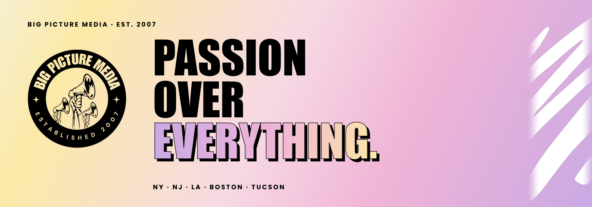

**A forward-thinking New York, New Jersey, LA, Boston, + Tucson based full-service entertainment & lifestyle public relations agency.**

Founded in 2007 by Dayna Ghiraldi-Travers. A boutique, all-female team of publicists for musicians and bands, festivals and events, labels and brands, and non-profits.

&nbsp;&nbsp;

 

## 📢 WHAT WE DO

We specialize in:

| | |
| --- | --- |
| 📺 **National television** | 📰 **Print magazines and newspapers** |
| 📻 **Syndicated + satellite radio** | 💻 **Digital features** |
| 🎙️ **Podcasts** | 📱 **Social media** |
| 🎥 **On-the-street content** | 🤝 **Brand partnerships** |

Our publicists truly love what we do.

## ⚡️ WHAT'S HERE

Team BPM builds some of its own tools. This is where they live.

| Repo | What it does |
| --- | --- |
| [`calendar`](https://github.com/bpmpub/calendar) | Artist shows in one place. Filter by publicist, artist, and city. |

Some repos stay private because they hold client info.
 

**NY · NJ · LA · BOSTON · TUCSON**

